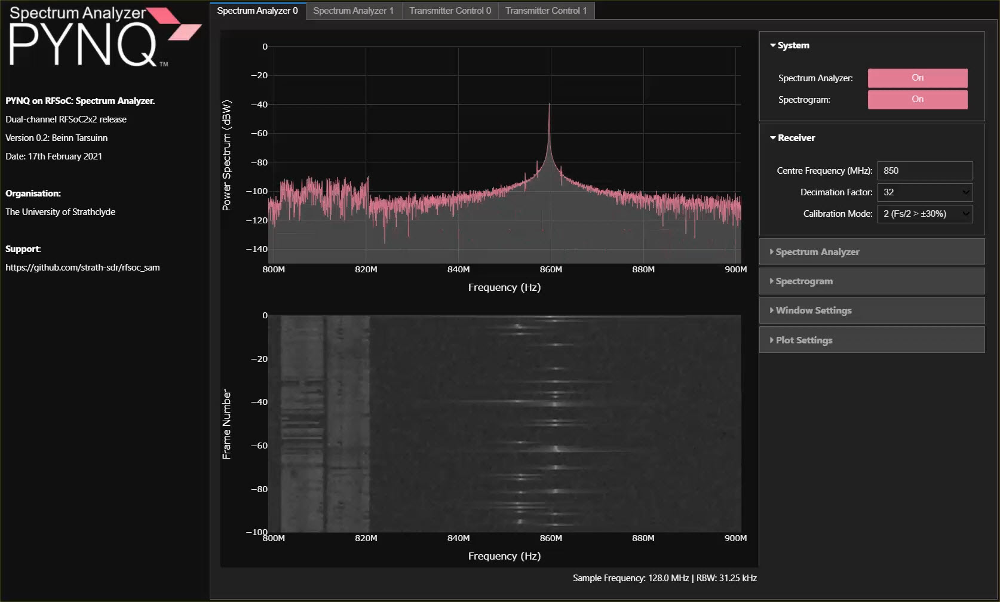

# The Strathclyde RFSoC Studio
This repository is only compatible with [PYNQ images v2.6](https://github.com/Xilinx/PYNQ/releases) for the [ZCU111](https://www.xilinx.com/products/boards-and-kits/zcu111.html) and [RFSoC2x2](http://rfsoc-pynq.io/).

## Introduction
This repository contains the RFSoC Studio installer, which will install several demonstrations and notebooks onto your RFSoC development board.

<figure align="center">
    
</figure>

[RFSoC Spectrum Analyser](https://github.com/strath-sdr/rfsoc_sam)

<br>
<br>

<figure align="center">
    
</figure>

[RFSoC Frequency Planner](https://github.com/strath-sdr/rfsoc_frequency_planner)

<br>
<br>

Other demonstrations include:
* [OFDM Demonstrator](https://github.com/strath-sdr/rfsoc_ofdm)
* [QPSK Demonstrator](https://github.com/strath-sdr/rfsoc_qpsk)
* [BPSK Demonstrator](https://github.com/strath-sdr/rfsoc_radio)
* [PYNQ Automatic Gain Control](https://github.com/strath-sdr/pynq_agc)

Educational notebooks:
* [DSP Notebooks for Wireless Communications](https://github.com/strath-sdr/dsp_notebooks)
* [RFSoC Introductory Notebooks](https://github.com/strath-sdr/rfsoc_notebooks)

## Quick Start
Follow the instructions below to install the RFSoC Studio on your development board. **You will need to give your board access to the internet**.
* Power on your RFSoC2x2 or ZCU111 development board with an SD Card containing a fresh PYNQ v2.6 image.
* Navigate to Jupyter Labs by opening a browser (preferably Chrome) and connecting to `http://<board_ip_address>:9090/lab`.
* We need to open a terminal in Jupyter Lab. Firstly, open a launcher window as shown in the figure below:

<p align="center">
  
<p/>

* Now open a terminal in Jupyter as illustrated below:

<p align="center">
  
<p/>

Now follow lets ensure all packages are uninstalled.

```sh
pip3 uninstall -y rfsoc-sam rfsoc-freqplan rfsoc-ofdm rfsoc-qpsk rfsoc-radio pynq-agc pystrath-dsp pystrath-rfsoc
```

We can now install the RFSoC Studio. This will install all of the above projects and notebooks, and will also add few additional notebooks.

```sh
pip3 install git+https://github.com/strath-sdr/rfsoc_studio
```

Once the installation has complete, your Jupyter home workspace will be populated with several folders installed by each package. You can access the `rfsoc-studio` folder and open the getting started notebook to begin using all of the demonstrations and educational resources.

Please complete installation by following the board specific instructions below.

## RFSoC2x2 Setup
The RFSoC2x2 does not require any additional setup.

## ZCU111 Setup
The ZCU111 requires an xrfdc patch, xrfclk patch, and optional Voila installation. Please follow the instructions below.

### The xrfdc Patch
It is absolutely essential that the xrfdc package is patched. This procedure will overwrite the xrfdc's `__init__.py`. You will not lose any current xrfdc functionality. You will gain thresholding capabilities and fabric read and write register configuration.

In the terminal window, run the following script:
```sh
mkdir /home/xilinx/GitHub
cd /home/xilinx/GitHub/
git clone https://github.com/dnorthcote/ZCU111-PYNQ
cd /home/xilinx/GitHub/ZCU111-PYNQ
cp /home/xilinx/GitHub/ZCU111-PYNQ/ZCU111/packages/xrfdc/pkg/xrfdc/__init__.py /usr/local/lib/python3.6/dist-packages/xrfdc/__init__.py
```

### The xrfclk Patch
We need to add a 384 MHz clock to the xrfclk package. We can simply overwrite __init__.py, with the changes.

In the terminal window, run the following script:
```sh
mkdir /home/xilinx/GitHub
cd /home/xilinx/GitHub/
git clone https://github.com/dnorthcote/ZCU111-PYNQ
cd /home/xilinx/GitHub/ZCU111-PYNQ
cp /home/xilinx/GitHub/ZCU111-PYNQ/ZCU111/packages/xrfclk/pkg/xrfclk/__init__.py /usr/local/lib/python3.6/dist-packages/xrfclk/__init__.py
```

### Voila Installation (Optional)
Many of the strath-sdr projects use Voila to create simple web applications using Jupyter notebooks. If you would like to use Voila on your ZCU111 development board, simply follow the instructions outlined in this [blog post](https://strath-sdr.github.io/pynq/linux/zynq/fpga/voila/2021/02/22/install-voila-on-pynq-v2-6.html). This is optional and not required to use the demonstrators.

## License
[BSD 3-Clause](/LICENSE)
