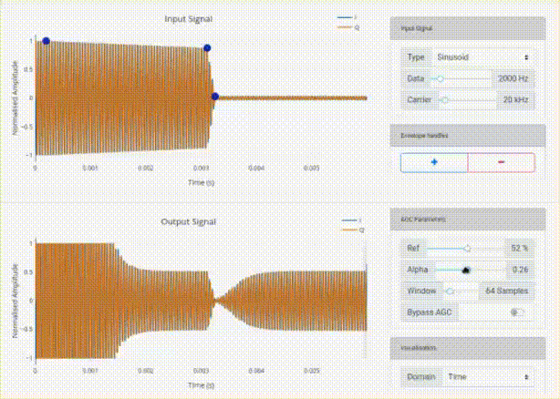

# The Strathclyde RFSoC Studio
This repository is only compatible with [PYNQ images v2.6](https://github.com/Xilinx/PYNQ/releases) for the [ZCU111](https://www.xilinx.com/products/boards-and-kits/zcu111.html) and [RFSoC2x2](http://rfsoc-pynq.io/).

## Introduction
This repository contains the RFSoC Studio installer, which will install the following demonstration and notebook projects onto your RFSoC development board:
* RFSoC Spectrum Analyzer
* RFSoC Frequency Planner
* OFDM Demonstrator
* QPSK Demonstrator
* BPSK Demonstrator
* PYNQ Automatic Gain Control
* DSP Notebooks for Wireless Communications
* RFSoC Introductory Notebooks

  

## License
[BSD 3-Clause](/LICENSE)
